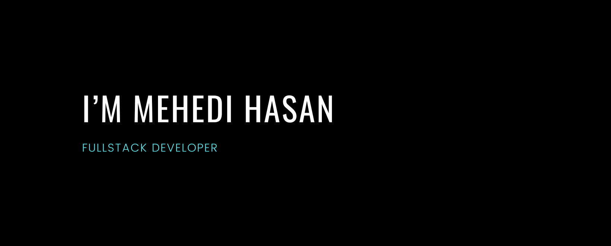

I'm Mehedi Hasan, a MERN Stack Developer with a passion for building innovative and user-friendly web applications. Driven by innovation and a thirst for knowledge, I'm constantly expanding my skillset and exploring new technologies.

<!-- ### Highlights: -->

Built several full-stack MERN applications from scratch.
Proficient in implementing various features such as user authentication, data fetching and manipulation, and API integration.
Continuously learning and exploring new technologies to stay ahead of the curve.

### Tech Stack:

       

### My Github Stats:

